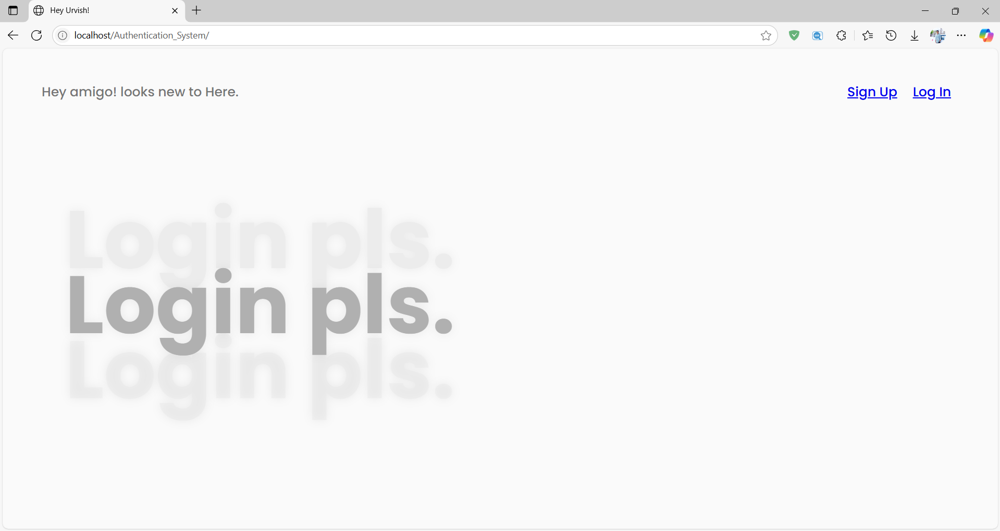
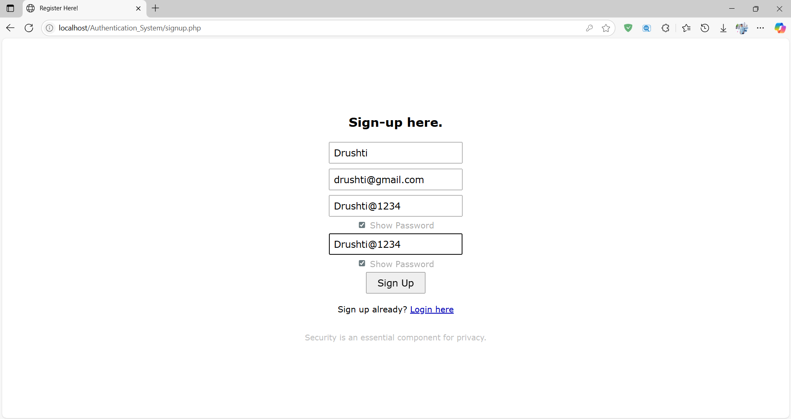
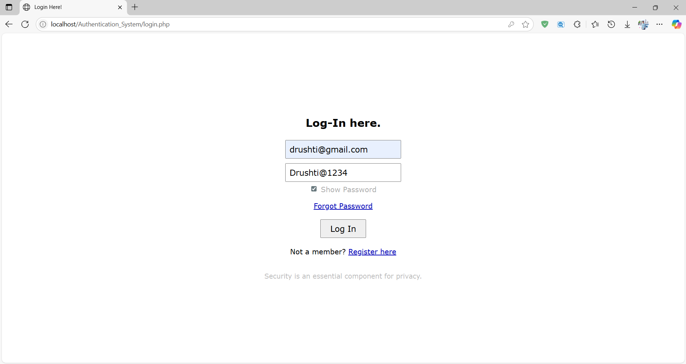

# Authentication System 🔐

## **📸 ScreenShots**
### **Home page of Site. 🏠**

A project that validate credential more complex and securly. prevent unwanted authentication without valid credentials.

more detailed Validation of forms:

prevent query insertion using stringify.
* convert input data into pure string and wrap in to quates. also prevent query firing.

Register:
* Name : not blank and must be alphabets
* Email : not blank and validation using regex. alphabet,num,@,domain,dot,com
* Password : not blank and 8 char long, Upper-lower case, numeric and symbol char. (must met with confirm password)

Login:
* Check credential with database.

---

---

---

---

### *feature*
### - Query senitization and valid validation of form using custum REGEX and other parameters.✨
---
Thank you for Showing Interest.😇
Open to contribute. 🫱🏻‍🫲🏻
---

@ Project By Urvish Patel